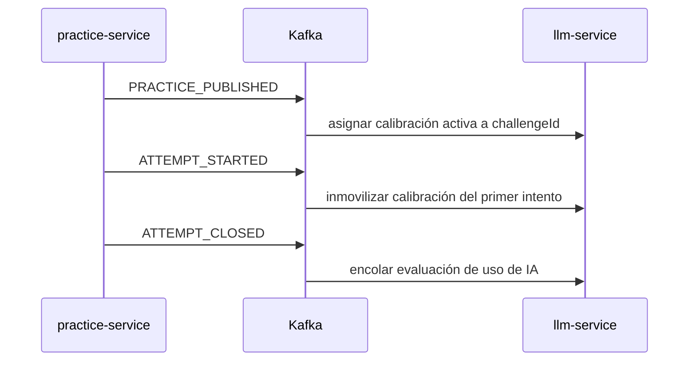

# Requisitos de entrada desde otros microservicios

> **Estado:** solicitud de contrato. Estos requisitos expresan lo que Tema 07 necesita recibir;
> no afirman que otro servicio ya lo publique o exponga. El dueño de cada dato debe confirmar el
> contrato antes de promoverlo a **Acordado**.

## Propósito

Tema 07 necesita estos datos para responder de forma pedagógica y evaluar de forma reproducible.
Este es el único documento de requisitos de entrada: cuando un dueño traiga su contrato, se
actualiza aquí y se referencia el contrato del dueño; no se crea un archivo paralelo por evento.

## Resumen por responsable

| Responsable | Tema 07 necesita | Canal propuesto | Estado |
|---|---|---|---|
| `practice-service` | Publicación de práctica, inicio/cierre de intento y contexto para invocar al tutor. | Kafka y HTTP hacia Tema 07. | Propuesto. |
| `courses-service` | Pertenencia docente activa de una cohorte. | HTTP desde Tema 07. | Propuesto. |
| `courses-service` | Aviso de archivo/cierre de cohorte para cancelar o resolver pendientes. | Kafka hacia Tema 07. | Pendiente de diseño del dueño. |
| `courses-service` | Catálogo de cohortes y desafíos calibrables (sincronización completa e incremental). | HTTP desde Tema 07. | Propuesto: ver RQ-CS-03. |
| `admin-service` | No aporta datos de dominio: consume la API de administración de Tema 07 con identidad delegada. | HTTP hacia Tema 07. | Propuesto en OpenAPI. |
| `challenges-service` | Ninguno directo. Practice es el dueño del ciclo de práctica e intento. | No aplica. | Decisión vigente. |

## A. Requisitos a `practice-service`

Tema 07 evalúa el uso pedagógico del tutor de IA. Para hacerlo de forma reproducible necesita
conocer tres hechos del ciclo de vida de una práctica: cuándo se publicó, cuándo comienza el primer
intento y cuándo ese intento se cerró.

## Reglas aplicables a los tres eventos

- Estándar del PDF `KAFKA.pdf` ([`KAFKA_EVENT_STANDARD.md`](KAFKA_EVENT_STANDARD.md)): envelope de cinco campos,
  `eventId` UUID, `eventType`, `timestamp`, `producer` y `payload`. **Sin `eventVersion`.** Todo en inglés.
- El nombre del tópico lo **asigna Notificaciones** (los grupos no crean tópicos); hoy se usa `practice-events`
  como nombre provisorio para los tres eventos. Los `eventType` van en `MAYÚSCULAS_CON_GUION_BAJO`.
- `traceparent` y `X-Request-Id` viajan en headers Kafka, nunca dentro del `payload`.
- La key de partición recomendada es `challengeId` para preservar el orden de publicación,
  inicio y cierre de una misma práctica.
- Kafka entrega al menos una vez. Tema 07 deduplica por `eventId`; `practice-service` puede
  reenviar sin provocar una segunda asignación, bloqueo o evaluación.
- Un evento inválido no se procesa parcialmente: se rechaza y queda en la tabla `event_dead_letter` de
  `llm-service` (no hay tópico `.dlt`: los grupos no pueden crear tópicos), con su `eventId` y `X-Request-Id`.

## RQ-PS-01 — Práctica publicada

**Evento solicitado:** `PRACTICE_PUBLISHED`.

**Cuándo publicarlo:** cuando una práctica pasa a estado publicado y puede recibir intentos. No se
publica por cada edición de borrador ni por una visualización.

**Qué hace Tema 07 al recibirlo:** consulta la calibración activa de la cohorte y crea la
asignación `challengeId → calibrationRunId`. Si no hay calibración activa, registra que la práctica
no tiene evaluación disponible; no bloquea ni altera la publicación de la práctica.

| Campo en `payload` | Tipo | Obligatorio | Motivo |
|---|---|---:|---|
| `challengeId` | UUID | Sí | Identifica la práctica/desafío al que se asigna la calibración. |
| `courseCohortId` | UUID | Sí | Ubica la práctica en la cohorte cuya calibración aplica. |
| `publishedAt` | date-time | Sí | Audita cuándo quedó disponible. |
| `publicationVersion` | entero o string inmutable | Sí | Distingue una publicación nueva de una retransmisión o edición posterior. |

**No necesitamos en este evento:** solución esperada, entrega del alumno, transcripción ni score.

## RQ-PS-02 — Primer intento iniciado

**Evento solicitado:** `ATTEMPT_STARTED`.

**Cuándo publicarlo:** exactamente al crear o iniciar el primer intento real del alumno. No se
repite para reintentos de guardado dentro del mismo intento.

**Qué hace Tema 07 al recibirlo:** inmoviliza la calibración ya asignada a `challengeId`. Una
recalibración posterior podrá aplicarse a prácticas sin intentos, pero no modifica la regla usada
por este intento ni por la práctica ya bloqueada.

| Campo en `payload` | Tipo | Obligatorio | Motivo |
|---|---|---:|---|
| `attemptId` | UUID | Sí | Identifica el primer intento que bloqueó la asignación. |
| `challengeId` | UUID | Sí | Encuentra la asignación de calibración a inmovilizar. |
| `courseCohortId` | UUID | Sí | Verifica que práctica e intento pertenecen a la misma cohorte. |
| `learnerId` | UUID | Sí | Trazabilidad de la evaluación posterior; no se usa en Golden Set. |
| `startedAt` | date-time | Sí | Auditoría y resolución de eventos fuera de orden. |

## RQ-PS-03 — Intento cerrado

**Evento solicitado:** `ATTEMPT_CLOSED`.

**Cuándo publicarlo:** una vez que el intento ya no admite cambios. Es el disparador de la
evaluación asíncrona. El alumno no espera el score para recibir el resultado normal de su entrega.

**Qué hace Tema 07 al recibirlo:** recupera la calibración inmovilizada, encola la evaluación del
uso del tutor y posteriormente publica `SCORE_CALCULATED` o
`SCORE_DEFERRED` para `practice-service`.

| Campo en `payload` | Tipo | Obligatorio | Motivo |
|---|---|---:|---|
| `attemptId` | UUID | Sí | Idempotencia y vínculo con el resultado emitido. |
| `challengeId` | UUID | Sí | Recupera asignación y calibración inmovilizada. |
| `courseCohortId` | UUID | Sí | Aísla la evaluación por cohorte. |
| `learnerId` | UUID | Sí | Vínculo académico y trazabilidad restringida. |
| `closedAt` | date-time | Sí | Orden, auditoría y SLA. |
| `tutorTranscript` | arreglo de mensajes ordenados | Sí | Evidencia completa para evaluar el uso pedagógico del tutor. |
| `challengeContext` | objeto | Sí | Contexto mínimo del desafío para interpretar la conversación. |

`tutorTranscript` debe conservar el orden, el rol de cada mensaje y contenido suficiente para la
evaluación. No debe incluir secretos, tokens, ni PII que no sea necesaria. Tema 07 no incorpora
esta transcripción a un Golden Set sin anonimización y aprobación docente.

### Invocación HTTP del tutor

`practice-service` invoca `POST /api/llm/tutor/interactions` a través del Gateway. El schema de
la petición y la respuesta está en [llm-service.openapi.yaml](llm-service.openapi.yaml); este
documento solo fija qué información debe poder aportar Practice.

| Dato | Obligatorio | Tratamiento en Tema 07 |
|---|---:|---|
| `attemptId`, `challengeId`, `courseCohortId` | Sí | Contexto y trazabilidad de la interacción. |
| Mensaje actual del alumno | Sí | Entrada a la respuesta pedagógica. |
| Nivel de riesgo o contexto pedagógico permitido | Sí | Aplica la política del tutor. |
| `expectedSolution` | Sí cuando exista solución | Solo memoria del guardarraíl anti-fuga; no prompt, log, persistencia, respuesta ni evento. |

El contrato M2M no debe transportar secretos del proveedor ni suplantar la identidad del alumno.
La identidad delegada llega en headers inyectados por Gateway y se rige por sus reglas de borde.

## B. Requisitos a `courses-service`

### RQ-CS-01 — Autorizar a un docente por cohorte

**Consulta propuesta:** `GET /api/courses/{courseCohortId}/members/{userId}` desde Tema 07 a
través del Gateway.

**Cuándo se consulta:** antes de crear, modificar o publicar rúbricas, Golden Sets, calibraciones
o configuración de modelos vinculada a una cohorte.

| Dato de respuesta mínimo | Obligatorio | Motivo |
|---|---:|---|
| `courseCohortId` | Sí | Corrobora el ámbito autorizado. |
| `userId` | Sí | Corrobora el sujeto delegado. |
| `role` | Sí | Determina si puede administrar recursos pedagógicos. |
| `membershipStatus` | Sí | Rechaza membresías inactivas, vencidas o removidas. |

**Respuesta esperada cuando no autoriza:** `404` si la cohorte o membresía no existe para el
solicitante, o `403` si existe pero el rol/estado no permite administrar. El dueño de Courses debe
confirmar la semántica final para no convertir una respuesta de autorización en fuga de datos.

### RQ-CS-02 — Archivo o cierre de cohorte

Tema 07 necesita una señal confiable si una cohorte se archiva o se cierra. Debe identificar al
menos `courseCohortId`, instante y estado final para impedir nuevas calibraciones y tratar las
evaluaciones pendientes de manera auditable. El nombre del evento, su política de pendientes y si
el cierre se bloquea o se rechaza son decisiones pendientes de `courses-service`.

### RQ-CS-03 — Catálogo de cursos y desafíos calibrables

**Consultas propuestas:** `GET /api/courses/calibration-catalog` (sincronización completa o
incremental) y `GET /api/courses/calibration-catalog/{courseCohortId}` (una cohorte puntual),
ambas desde Tema 07 a través del Gateway.

**Para qué:** Tema 07 necesita saber qué cohortes y desafíos son calibrables sin descargar ni
inferir el catálogo de Courses. Courses entrega solo relación, estado y versiones — nunca
soluciones esperadas, tests ocultos, transcripciones ni contenido pedagógico sensible.

| Parámetro / campo | Tipo | Obligatorio | Motivo |
|---|---|---:|---|
| `cursor` (query, solo en la sincronización completa) | string | No | Pagina resultados grandes. |
| `size` (query) | entero 1–100 | No | Tamaño de página. |
| `updatedSince` (query) | date-time ISO-8601 | No | Sincronización incremental. |
| `courseCohortId` | UUID | Sí | Identifica la cohorte. |
| `courseId` | UUID | Sí | Identifica el curso académico. |
| `courseState` | `ACTIVE` \| `ARCHIVED` | Sí | `ARCHIVED` bloquea nuevas activaciones/evaluaciones en Tema 07. |
| `catalogVersion` | entero | Sí | Un valor mayor reemplaza la proyección local de esa cohorte. |
| `challenges[].challengeId` | UUID | Sí | Identifica el desafío. |
| `challenges[].challengeVersion` | entero | Sí | Un valor mayor invalida la asignación de calibración anterior del desafío. |
| `challenges[].publicationState` | string | Sí | Solo `PUBLISHED` + `requiresCalibration=true` habilita una nueva asignación. |
| `challenges[].requiresCalibration` | boolean | Sí | Ver fila anterior. |
| `challenges[].calibrationScope` | string | Sí | Alcance de la calibración (p. ej. por curso). |

**Errores esperados en la consulta puntual:** `404` si la cohorte no existe, `403` si Tema 07 no
está autorizado — ambos como Problem Details.

**Estado:** propuesto por Tema 07; requiere aprobación del dueño de Courses (ruta exacta, scopes
JWT, paginación y semántica de `updatedSince`). No implementar un consumidor de este catálogo
asumiendo que ya está acordado.

## C. Límites deliberados

- `admin-service` no entrega ni recibe claves de proveedores LLM: solo invoca la API de Tema 07;
  las credenciales se envían una vez como `writeOnly` y se devuelven enmascaradas.
- Tema 07 no consulta a `challenges-service` de manera directa. El contexto de desafío y el
  resultado de evaluación se intercambian con `practice-service`.
- No se solicita una copia de la base de datos, transcripciones sin filtro ni PII adicional. Cada
  requisito debe justificar su necesidad pedagógica u operativa.

## Confirmaciones necesarias de los responsables

1. ¿`challengeId` identifica de forma estable la práctica publicada y se conserva entre eventos?
2. ¿Cuál es el estado exacto que equivale a “publicada y disponible para recibir intentos”?
3. ¿Existe `intento_iniciado`? Si no, ¿qué evento confiable ocurre antes de que un intento pueda
   quedar cerrado?
4. ¿Qué formato normalizado usa `tutorTranscript` y qué límite de tamaño admite Kafka?
5. ¿La práctica puede cambiar de cohorte o republicarse? Si sí, ¿cómo se distingue una versión de otra, ahora que el estándar no tiene `eventVersion`?
6. ¿Qué retención y reintento rigen para estos tres eventos? (No hay tópico dead-letter: los rechazos quedan en `event_dead_letter`.)
7. Courses: ¿cuál es el endpoint, scope y semántica definitiva para validar membresía docente?
8. Courses: ¿qué evento representa archivo/cierre de cohorte y cómo deben resolverse los
   pendientes de evaluación?
9. Courses: ¿cuál es la ruta, los scopes JWT y la semántica de paginación/`updatedSince` para el
   catálogo de calibración (RQ-CS-03)?
